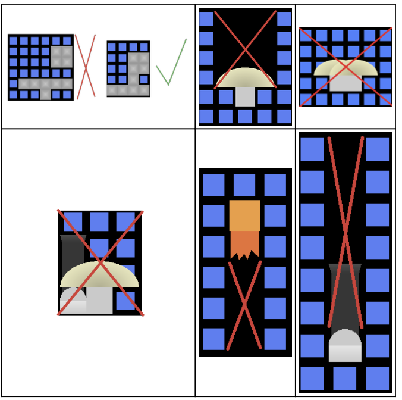

# Arcade Machine – Custom 2D Game Project (C++ & OpenGL)

> A modular 2D game built from scratch in **C++ using OpenGL**, featuring an interactive **spaceship editor**, custom geometry generation, and a **Breakout-style arcade game**.

> This is not a tutorial project — it is a complete interactive system implemented without a game engine.
---

## Project Overview

This project demonstrates low-level **graphics programming**, **game logic**, and **system design** through a complete 2D game pipeline.  
Players design their own spaceship using an editor, validate it through strict constraints, and then use it as the paddle in a Breakout-inspired game.

---

## Key Features

- Interactive **drag & drop spaceship editor**
- Grid-based construction with real-time validation
- DFS-based connectivity check
- Breakout-style gameplay with physics-inspired collisions
- Brick durability & destruction animation
- Custom 2D geometry (no external shape libraries)
- Modular and extensible architecture

---

## Spaceship Editor

The game starts in an **editor mode** where the player designs a spaceship on a **17×9 grid**, using a maximum of **10 components**.

### Components
| Component | Description |
|---------|------------|
| Solid Block | Basic structural unit |
| Engine | Movement-related component |
| Gun | Vertical extension component |
| Bumper | Defensive component |

### Editor Features
- Drag & drop placement
- Right-click removal
- Remaining components counter
- Start button with live validity feedback

### Validation Rules
- At least one component required
- All components must be **connected**
- Strict placement constraints between components
- Maximum of 10 blocks

Connectivity is validated using **Depth-First Search (DFS)**.

---

## Game Mode – Breakout

Once the spaceship is valid, it is **instantiated as the paddle** in a Breakout-style game.

### Gameplay Mechanics
- Ball launched at a 45° angle
- Paddle-ball collision angle depends on impact point
- Multi-hit bricks with different durability levels
- Brick destruction animation
- Score & lives system (3 lives)

### Controls
| Action | Key |
|------|-----|
| Move Paddle | ← / → |
| Launch Ball | SPACE |
| Return to Editor | B |

---

## Collision System

- **Ball ↔ Walls** – elastic reflection
- **Ball ↔ Paddle** – angle adjusted based on hit position
- **Ball ↔ Bricks** – durability reduction & destruction
- **Ball ↔ Bottom Wall** – life lost and reset

---

## Custom Geometry System

All objects are rendered using **procedurally generated meshes**:
- Squares
- Triangles
- Circles
- Semicircles
- Trapezoids
- Lines

Meshes are created manually using vertex and index buffers, providing **direct OpenGL-level control**.

---

## Visual & UX Details

- Orthographic 2D camera
- High-DPI (Retina) scaling support
- Smooth brick destruction animation
- Clean UI with real-time text rendering
- Visual feedback for interactions

---

## Tech Stack

- **Language:** C++
- **Graphics API:** OpenGL
- **Math Library:** GLM
- **Rendering:** Custom 2D pipeline
- **Platform:** Windows / macOS

---

## Possible Extensions

- Multiple balls support
- Power-ups & abilities
- Particle effects
- Camera shake
- Component-based entity system

---

## Purpose

Developed as part of an advanced **Computer Graphics & Game Programming** curriculum, focusing on engine-level concepts and performance-aware design.
